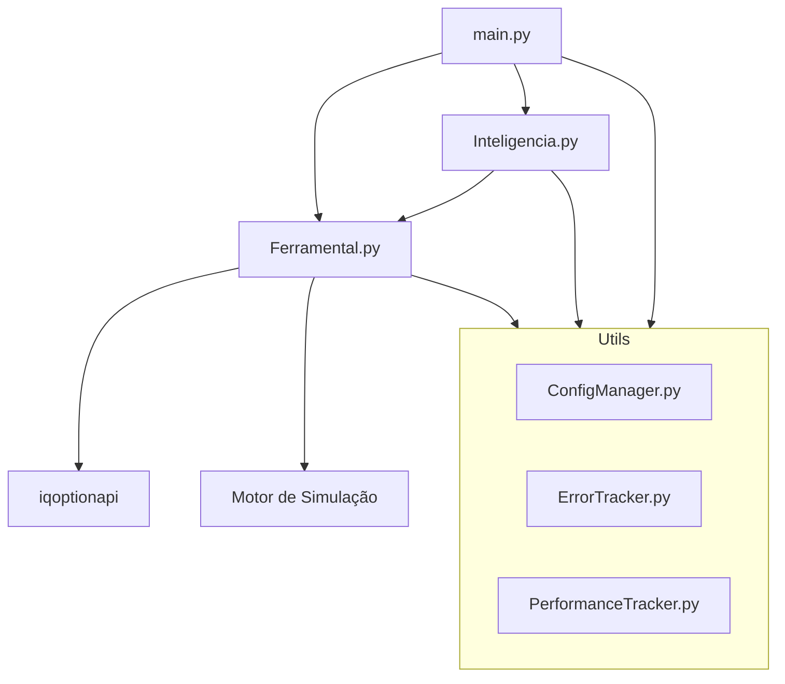

# Visão Geral do Sistema: BotIQOpt

O BotIQOpt é um robô de negociação automatizado para a plataforma IQ Option, projetado com uma arquitetura modular, resiliente e extensível. Ele separa a lógica de execução (Ferramental), a lógica analítica (Inteligencia) e o gerenciamento de sistema (Utils).

## Arquitetura de Camadas

### Componentes Principais

1.  **`main.py`**:
    *   O ponto de entrada da aplicação.
    *   Gerencia o loop principal de execução.
    *   Coordena o fluxo de trabalho entre o Ferramental e a Inteligencia.
    *   Lida com a inicialização e o desligamento seguro do bot.

2.  **`ferramental/Ferramental.py`**:
    *   Gerencia a conectividade com a IQ Option.
    *   Executa ordens (REAIS ou SIMULADAS).
    *   Implementa um motor de geração de dados sintéticos para testes.

3.  **`inteligencia/Inteligencia.py`**:
    *   Analisa os dados de mercado.
    *   Calcula indicadores técnicos (RSI, Bollinger, Médias Móveis).
    *   Gera sinais de entrada (Call/Put).

4.  **`utils/`**:
    *   Configuração centralizada, rastreamento de erros e métricas de performance.

## Fluxo de Operação

1.  **Inicialização**: O bot carrega as configurações e inicializa os Singletons (`Ferramental`, `Inteligencia`).
2.  **Conexão**: O `Ferramental` estabelece conexão com a IQ Option ou ativa o modo de simulação.
3.  **Monitoramento**: O loop principal solicita dados de mercado em tempo real.
4.  **Análise**: A `Inteligencia` processa os dados e busca por sinais técnicos.
5.  **Execução**: Se um sinal é validado pelo gerenciamento de risco, o `Ferramental` executa a ordem.
6.  **Pós-Trade**: O sistema registra o resultado e ajusta as métricas de performance.

## Segurança e Resiliência

*   **Gerenciamento de Risco**: Proteção contra perdas excessivas (Stop Loss diário e por operação).
*   **Tratamento de Exceções**: Registro detalhado e recuperação de falhas de rede.
*   **Modo de Simulação**: Permite validação completa da lógica sem risco de capital.
